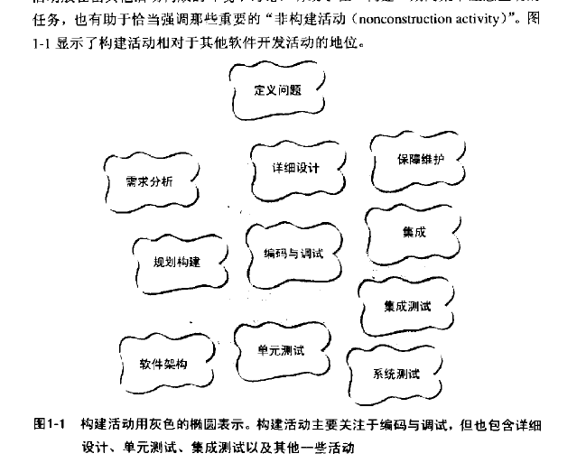
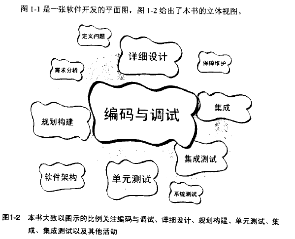

开发计算机软件已是一个复杂的过程。在过去 25 年间，研究者已经认识到软件开发过程中的各种不同的活动（activity）：

- 定义问题（problem definition）

- 需求分析（requirements developments=）

- 规划构建（construction planning）

- 软件架构（software architecture），或高层设计（high-level design）

- 详细设计（detailed design）

- 编码与调试（coding and debugging）

- 单元测试（unit testing）

- 集成测试（integration testing）

- 集成（integration）

- 系统测试（system testing）

- 保障维护（corrective maintenance）

在太不正规和太正规之间找一个平衡点是不容易的。

如果你是自学编程，或者主要做一些不太正规的项目，你可能都无法再软件开发过程中分辨出这么多活动。

在你心里，这些活动很可能都被归为“编程（programming）”了。当你在做不太正规的项目时，你考虑创建软件的问题时所想到的那项主要活动，很可能就是研究者们称之为“构建”的活动。

这个直觉上对“构建”的认知是相当准确的，但它缺乏一点深度。把构建活动放在其他活动构成的环境中讨论，有助于在“构建”期间集中注意正确的任务，也有助于恰当强调那些重要的“非构建活动（nonconstruction activity）”。

该书（代码大全）是一本关于软件构建技术的手册，它会重点关注构建活动以及与之相关的话题。假如这本书是一条小犬的话，那么它会亲切地嗅着构建，而冲着设计和测试摇尾巴，并对着其他开发活动汪汪叫。

构建有时也被认为是“编码（coding）”或“编程（programming）”。“编码”算不上是最贴切的词，因为它有一种“把已经存在的设计机械化地翻译成计算机语言”的意味；而构建并不都是这么机械化的，需要可观的创造力和判断力。

图1-1 和 图 1-2 都是关于构建活动的高层次视图，但细节是什么？

以下列出一些构建活动中的具体任务（task）。

- 验证有关的基础工作已经完成，因此构建活动可以顺利地进行下去。

- 确定如何测试所写的代码。

- 设计并编写类（class）和子程序（routine）

- 创建并命名变量（variable）和具名常量（named constant）

- 选择控制结构（control structure），组织语句块

- 对你的代码进行单元测试和集成测试，并排除其中的错误

- 评审开发团队其他成员的底层设计和代码，并让他们评审你的工作。

- 润饰代码，仔细进行代码的格式化和注释

- 将单独开发的多个软件组件集成为一体

- 调整代码（tuning code），让它更快、更省资源。

----

有哪些活动不是“构建”的一部分呢？

一些重要的非构建活动包括管理（management）、需求分析、软件架构设计、用户界面设计、系统测试，以及维护。

