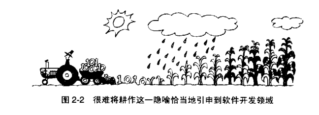

### 2.3  Common Software Metaphors

常见的软件隐喻

围绕着软件开发的令人困惑的隐喻越来越多。

|  Event-Time    |		Note 		|
|----------------|------------------|
|David Gries 说编写软件是一门科学 (a science)（1981）; | ~ |

|而 Donald Knuth 说它是艺术 (an art)（1998）；| ~ |

|Watts Humphrey 则说它是一个过程 (a process)（1989）；| ~ |

|P.J.Plauger 和 Kent Beck 都说它就像是驾驶汽车（Driving a car）| ~ | —— 可他们两个却几乎得出了完全相反的结论（Plauger 1993, Beck 2000）。|

Alistair Cockburn 说它是一场游戏（a game）(2002);

Eric Raymond 又说它就如同是一个集市（bazzar）（2000）;

Andy Hunt 和 Dave Thomas 说它就像园艺（gardening）一样；

Paul Hecker 则说它就像是拍摄《白雪公主和七个小矮人》（1994）;

而 Fred Brooks 说它像耕田、像捕猎、或像是跟恐龙一起淹死在“焦油坑”里面（1995）

--- 到底哪一个隐喻最好呢？

----

### Software Penmanship: Writing Code

软件中的书法：写作代码

关于软件开发的最原始的隐喻是从“写作（writing）代码”这个说法发展出来的，这一隐喻暗示着开发一个程序就像写一封有缘由的信一样——坐下来，拿出文房四宝，从头到尾就写完了。这时不需要正规地做计划，你想到什么东西把它写出来就是了。

许多的想法就是从写作这个隐喻衍生而来的。比如 Jon Bentley 说，你应该可以坐在火炉边上，品一杯白兰地或抽一口上好的雪茄，边上坐着你心爱的猎犬，去品味一段“深奥的程序”，就像面对的是一本出色的小说那样。

Brian Kernighan 和 P.J. Plauger 参考一本关于写作体裁的书《文体的要素》（<The Elements of Style>， Strunk and White 2000），将他们关于编程风格（Programming style）的书命名为《编程风格的要素》（《The Elements of Programming Style》,1978）。

程序员们也经常讨论“程序的可读性（readability）”。

对于个人规模的工作乃至小型的项目来说，这种写信的隐喻已经足够了，然而对于其他场合而言，这个隐喻还远远不够——它没有完整、充分地刻画软件开发工作。

书写通常只是个人的活动，而一个软件项目多半涉及承担许多不同职责的很多人。在你写完一封信之后，你只要把它塞进信封然后寄出去就完了，你再也不能修改它——从任何程度和目的上看，这件事情都已经结束了。

而软件的修改没那么难，也很难说有真正完全结束的时候。

典型的软件系统在其首次发布之后的工作量，可能达到整个工作量的 90%，典型情况下也有三分之二多（Pigoski 1997）。

对写作而言，最重要的是其原创性。但是对于软件构建来说，“努力创造真正的原创成果”的开发效率，往往低于专注于重用（reuse）以往项目的一些设计思想、代码以及测试用例（test case）。

总之，写作这一隐喻所暗示的软件开发过程太过简单、太过呆板了。

----

Plan to throw one away, you will, anyhow.  - Fred Brooks

如果你计划抛弃一个，那么你将会抛弃两个。  - Craig Zerouni

----

然而不幸的的是，这种用文字（信件）写作所做的隐喻通过一本在软件领域最为流行的著作之一—— Fred Brooks 的《人月神话》（<The Mythical Man-Month>， Brooks 1995）而变成了不朽的思想。

Brooks 说：“要计划抛弃一个，你必定会那样，无论如何。”

这个咒语给了我们一幅图如下所示的景象：被抛进纸篓里的成堆的半成品草稿。

> （文字写作这一隐喻暗示着软件开发过程是一种代价昂贵的试错（trial and error）过程，而非仔细的规划和设计）

在给你叔叔写一封“最近好吗”这样的礼节性问候信时，“计划扔掉一张草稿”也许还比较实际。

但如果将“书写软件”这个隐喻引申为“计划扔掉一个（软件）”，则不是一个好的建议——尤其是在软件的主要系统就已经花费了相当于一栋十层高的办公楼或一艘远洋客轮这么多成本时。

要想中奖不难，只要你能忍受坐在你钟情的旋转木马上转上无数圈就行。诀窍在于当作第一次尝试的时候就让它成功——或者再成本最低的时候多试几次。

其他一些隐喻更好地阐明了达到这个目标的途径。

----

### Software Farming: Growing a System

软件的耕作法：培植系统

相对于前面那个呆板的用写作所做的隐喻，一些软件开发人员则认为应当将创造软件想象成类似播种和耕作的情形。

你一次设计系统的一小部分、写出一段代码、做一点测试，并将成果一点点添加到整个系统中。通过这种小步前进，你可以把每次可能遇到的麻烦减到最小。

有时候人们会用很糟的隐喻去描述一种很好的技术，此时需要保全这一技术，并去寻找更好的隐喻。**这个例子里的增量技术是很有价值的**，***但把它比作播种和耕作却非常糟糕。***

“每次做一点” 这个主意可能在某些方面与农作物生长类似，但把软件开发类比为耕作就很不贴切，也没有太多意义，而且我们很容易用下面即将介绍的更好的隐喻替代它。人们也很难把耕作这个隐喻引申到“一次做一点事情”之外。

如果你认同耕作这种隐喻，就请想象一下图的情况：你会发现自己谈论的是：对系统计划施肥、对细节设计蔬果，并通过有效的管理土地来增加代码的产量，最终取得代码大丰收。你还会说“轮种C++ 和大麦”，或者让土地闲置一年以增加硬盘里面氮肥的供应量。

软件耕作这一隐喻的弱点在于它暗示了人们将无法对开发软件的过程和方式进行任何直接的控制。你在春天播下代码的种子，然后按照农历节气向土地儿许几个愿，你将会在秋天收获丰盛的代码。

（很难将耕作这一隐喻恰当地引申到软件开发领域）

----

### Software Oyster Farming: System Accretion
软件的牡蛎养殖观点：系统生长

在谈论培育（growing）软件的时候，有时人们实际上是指软件的生长（acccretion），这两种隐喻是紧密相关的，而软件生长是一副更发人深省的景象。

看到“生长”这个词，就算手头没有字典，我们也都能明白它指的是通过外在的增加或吸收而逐渐地生长或变大。

“生长”这个词描述了牡蛎制造珍珠的过程，逐渐地增添微量的碳酸钙。在地质学里，“accretion” 一词的意思是“冲积层”，指的是水流中夹带的沉淀物的冲积而不断扩大的陆地。

在正式的术语中，“冲积层”是指海岸沿线的陆地因受到水流冲击，水中夹带的物质不断沉积而形成的增长。

这里并不是说要你学会如何从水流中夹带的沉积物中提炼出代码来，而是说你需要学会如何一次为软件系统增加一个小部分。跟“生长”密切相关的另一些词语：“增量的（incremental）”、“迭代的（iterative）”、“自适应的(adaptive)” 以及 “演进的（evolutionary）”。

**以增量方式进行设计、编译和测试，都是目前已知的最强有力的软件开发概念。**

在进行增量式开发时，我们先做出软件系统的一个尽可能简单、但能运行的版本。它不必接受真实的输入，也无须对数据进行真正的处理，更不用产生真实的输出——它仅仅需要构成一个足够强壮的骨架，支撑起未来将要开发的真实系统。

对于你标志出的每一项基本功能，可能仅需要调用虚假的类（dummy classes）。这个最基本的起点，就像牡蛎开始孕育珍珠的那颗细小沙粒。

在骨架形成之后，你要一点点地在其上附着肌肉和皮肤：把每个虚假的类替换为真正的类；不再假装接受输入，而是把接收真实输入的代码替换进去；不再假装产生输出，而是把产生真实输出的代码替换进去。

你一次增加一小部分代码，直到得到一个完全可以工作的系统。

支持这一方法的一件逸事或曰证据令人印象深刻。那位在 1975 年建议我们建造一份（软件）以备扔掉（building one to throw away）的 Fred Brooks 说，在他写完了里程碑式的著作《人月神话》之后的十年间，没有什么能像增量式开发那样彻底地改变了他个人的开发习惯及其效力（1995）。

Tom Gilb 在他突破性的著作《软件工程管理原理》（The principles of Software Engineering Management，1988）中也同样指出了这一点，该书介绍了演进式交付（Evolutionary Delivery），它在很大程度上奠定了如今敏捷编程（agile programming）方法的基础。

眼下不少方法论都是基于这一理念（Beck 2000: Cockburn 2002; Highsmith 2002; Reifer 2002; Martin 2003; Larman 2004）。

作为一个隐喻而言，增量式开发的优势在于未做过度的承诺。比起耕作那个隐喻来，对它作不恰当地引申要更困难一些。牡蛎孕育珍珠的图景也很好地刻画了增量式开发（或说生长）的情形。

