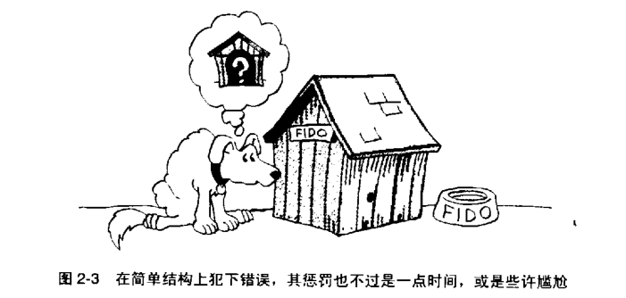
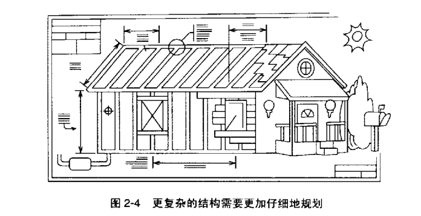

2.3.2 

### Software Construction: Building Software

软件构建：建造软件

与“写作（writing）”软件或者“培育（growing）”软件而言，“建造（building）”软件的图景就更加有用了。

它和软件生长的概念是相通的，且提供了更详细的指引。

建造软件这一说法暗示了软件开发中存在着诸多阶段，如计划、准备及执行等，根据所建造软件的不同，这些阶段的种类和程度可能会发生变化。进一步研究这一隐喻时，你还会发现许多其他方面的相似之处。

要搭一座四足的塔（four-foot tower），你要有一双稳健的手，要找一个平坦的表面，以及十来个完好无损的啤酒罐。

而要搭一座比它大 100 倍的塔，光是多 100 倍的啤酒罐还不够，还需要同时采用完全不同的计划方法和建造方法才行。


如果你要盖一个简单的建筑物——比如一个狗屋——你先开车到木材店买些木头和钉子。临近傍晚时分，你的爱犬 Fido 就有新窝了。如果你像图 2-3 那样忘了弄个门，或是犯了其他什么错误，那也没什么大不了的，修改一下或者干脆从头再来就是了。

你的损失最多也就是一个下午的时间。这种宽松的方式对于小型的项目来说也换算合适。

如果你写 1000 行的代码时采用了错误的设计，你还可以重构甚至从头再来，不会损失太多。




如果你是在建一栋房子，那么这个建造过程就会复杂得多，而糟糕的设计所引发的后果也严重。

首先你要决定准备建一个什么类型的房子——**在软件开发里的类似事项称为问题定义（problem definition）。**


接下来，你必须和某个建筑师（architect）探讨这一总体设计，并得到批准。这跟软件架构设计（architectural design）十分相似。

然后你画出详细的蓝图，雇一个承包人。**就像软件的详细设计。**

再然后，你要准备好建造地点，打好地基，搭建房屋框架，砌（qi）好边墙，盖好房顶，同好水、电、煤气等。**这就如同是软件的构建（construction）一样。**

在房子大部分完成之后，庭院设计师、油漆匠和装修工还要来把你新盖的家以及里面的家什美化一番。**这就好比软件的优化（oprimization）过程。**

在整个过程中，还会有各种监查人员来检查工地、地基、框架、布线以及其他需要检查的地方。**这相当于软件复查（评审，review）和复查（inspections）。**


----

在这两种活动中，更高的复杂度和更大的规模都会带来更多的结论。盖房子的时候，建材多少也是有些昂贵，但主要的开销还是在人力上。把移动墙推到然后移动半尺是很昂贵的，倒不在于浪费了多少钉子，而是因为你要付给工人们更多的工钱，移动这堵墙耗费了额外的工时。

你只有尽可能地把房子设计好，就像图 2-4 那样，这样你才不用浪费时间去修正那些本来可以避免的错误。

在开发一个软件产品时，原材料甚至更加廉价，但劳动力上的花销也更昂贵。变更一份报表的格式所要付出的代价，和移动房间里的一堵墙一样高昂，因为两者的主要成本构成部分都是花费人的时间。




----

除此之外，这两种活动还有什么相似之处呢？建造一个房子的时候，你不会试着去建造那些买得到的现成的东西。你会买洗衣机、烘干机、洗碗机、电冰箱以及冷藏柜。

除非你是机电方面的巫师，否则你是不会考虑自己动手弄这些东西的。你还会购买预先造好的橱柜、餐桌、门窗以及浴具，等等。

当开发软件时，你也会这么做的。你会大量使用高级语言所提供的功能，而不会自己去编写操作系统层次的代码。你可能还要用些现成的程序库，比如说一些容器类（container classes）、科学计算函数、用户界面组件、数据库访问组件，等等。

总之，自己编写那些能买得到的现成的代码通常是没有意义的。


但如果你要建造一间拥有一流家具的高档住宅，那你可能需要特别订制的橱柜，还可能需要能和这些橱柜相搭配的洗碗机、冰箱和冷藏柜等，也可能需要以特殊的形状和特别尺寸订制的窗户。

在软件开发中也有和这种订制相似的情况。

如果你要开发一款一流的软件产品，你可能会自己编写科学计算函数一遍获得更快的速度和更高的精度。你还可能需要自己编写容器类、用户界面组件以及数据库访问组件等，这样做可以让产品的各个部分无缝拼接，拥有一致的外观和体验。


适当的多层次的规划对于建造建筑物和构建软件都有好处。如果你按错误的顺序构建软件，那么编码、测试和调试都会更难。需要花更长的时间才能完成甚至整个项目干脆就分崩离析了——由于每个人的工作都过于复杂，所有成果合在一起的时候就变得混乱不堪了。


----

精心计划，并非意味着事无巨细的计划或者过度的计划。你可以把房屋结构性的支撑（structural support）规划清楚，而在日后再决定时用木地板还是地毯，墙面漆成什么颜色，屋顶使用什么材料，等等。


一项规划得当的项目能够提升你“在后期改变细节（设计）”的能力。你对同类软件的开发经验越丰富（在开发新软件时）就能**认准**更多的细节。你只需要保证已经做了足够的计划，不会到后来因为计划上不足而引发重大问题。*（（认准））*


用建筑房屋来类比软件构建，还有助于解释为什么不同的软件项目能从不同的开发方法中获益。建筑业中，改建仓库或者工具房，或是一座医院或者核反应站，你在规划、设计及质量保证方面所需达到的程度是不一样的。

盖一座学校、一幢（zhuang）摩天大楼，或一座三居室的小别墅，所用的方法也不会相同。同理，在软件开发中，通常你只需要用灵活的、轻量级的（lightweight）方法，但有时你就必须得用严格的、重量级的开发方法，以达到所需的安全性或其他什么目标。


----

软件的变动在建筑领域也有类似事物。把一堵承重墙异动半尺所需花费的成本，肯定要比仅仅移动一面隔墙更高。同样，对软件进行结构性的修改所需花费的成本，肯定也比仅仅增删一些周边功能更高。


最后，建筑这一隐喻让人们对超大型的软件项目的认识更加深刻。超大型的结构一旦出现问题，后果将非常严重，因此有必须对这样的结构进行超出常规的规划与建设（over-engineered）。建筑人员需要非常小心地指定并核查设计规划，在建设时留有余地以保障安全；宁可多花 10% 的成本买更坚固的材料，也比摩天大楼倒下来要划算得多。还需要特别关注工作的时间。


在建造帝国大厦（The Empire Building）的时候，每辆材料车运输时都留有 15 分钟的余地。如果某辆车没能在指定时间到位，则整个工期就会延误。


同理，对于超大型的软件项目，就需要比一般规模的项目有更高级别的规划设计。Capers Jones 发表的报告称，一套 100 万行代码的软件系统，平均需要 69 种代码（1998）。其需求规格文档一般有四五千页长，而设计文档常常是需求的两三倍长。不太可能有哪一个人能完全理解这种规模的项目的所有设计细节——甚至只是通读一遍都不那么容易。因此，更充分的准备工作也就理所应当了。


如果需要创造在经济规模上可以匹敌帝国大厦的庞大的软件项目，那么与之相当水准的技术与管理控制也是必需的。


按房屋建筑所作的这一隐喻，可以向许多其他方向引申——这也是隐喻这一方法如此强有力的一个原因。有很多常见的软件开发术语都是从建筑这一隐喻中衍生出来的：软件架构（建筑学，architecture）、支撑性测试代码（脚手架，scaffolding）、构建（建设，construction）、基础类（foundation classes）以及分离代码（tearing code apart）。你可能还听说过更多这一类的词语。

----

```
关于“构建隐喻”的引申，请见“是什么支撑起了天花板（What supports the Roof）”一文。

```


