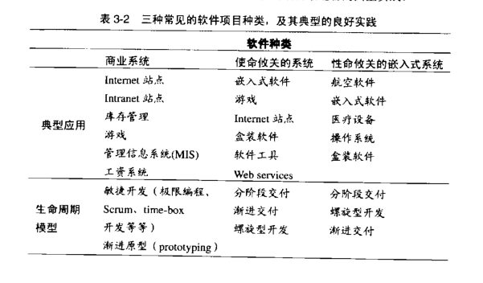
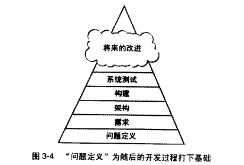

3.2.x  Determine the Kind of Software You're Working On
辨明你所从事的软件的类型

Caper Jones 是 Software Productivity Research(软件生产率研究)的首席科学家，他回顾 20 年的软件研究，指出他和同时见过不止 700 种不同的编程语言，以及 40 中收集需求的方法、50 种进行软件设计的方法、30 种针对项目的测试方法。

不同种类的软件项目，需要在“准备工作”和“构建活动”之间做出不同的平衡。每一个项目都是独特的，但是项目可以归入若干种开发风格。

表 3-2 列出了三种最常见的软件项目种类，并且列出了各种项目最适合的典型实践。

----

在真实项目中，你会找到表中所列这三种主调的无数种变奏；无论如何，表中已经列举了它们的共性。

*开发商业系统的项目*往往受益于**高度迭代的开发法**，这种方法的“计划、需求、架构”活动与“构建、系统测试、质量保证”活动交织在一起。

*性命攸关的系统往*往要求采用更加序列式的方法——“需求稳定”是确保“超高等级的可靠性”的必备条件之一。

----

### Iterative Approaches' Effect on Prerequisites
迭代开发法对前期准备的影响

有些作者断言，使用迭代技术的项目基本无须关注前期准备，但这种观点是错的。
迭代方法往往能够减少“前期准备不足”造成的负面影响，但是它不能完成消除此影响。

让我们看一下表 3-3 所示的例子，这两个项目都没有关注前期准备工作。

- 第一个项目按序列化开发法运作，并且仅仅依赖于测试来发现缺陷。

- 第二个项目则是按迭代方式运作，并且随着项目的进展不断找出错误。

第一个方法将绝大部分缺陷修正工作推迟到项目快结束的时候进行，使得成本较高。（如表 3-1 所述）

而迭代式开发法在项目进行过程中一点点地吸收消化返工，这样使得总体成本较低。这个表中的数据和下一个表中的数据仅仅是为了距离说明，但是这两种通常的开发方法的成本的这种相对关系，是收到本章前面部分提到的那些研究支持的。

----

那些简化或取消了前期准备工作的迭代型项目与采用同样做法的序列项目相比，有两点不同。首先，平均的缺陷修正成本低一些，因为发现缺陷的时间往往更接近引入该缺陷的时间。

然而，每一轮迭代仍然要到最后才能检测到缺陷，为了修正这些缺陷，需要对软件的某些部分进行重新设计、重新编码并重新测试——这使得修正缺陷的成本高于实际需要。

其次，使用迭代式开发法，成本将会在整个项目过程当中分次支付，而不会聚集中项目末尾一次性支付。整个项目尘埃落定之后，实际的总成本是相似的，但是看起来却没有那么高，因为开发费用是在整个项目进行过程中分期支付的，而不是在项目最后一次性结账。

如表 3-4 所示，无论你使用的是迭代式开发法环视序列式开发法，只要进行前期准备，就可以减少成本。“迭代式开发法通常是更好的选择”这一观点有很多的理由支持。但是忽略前期准备的迭代式开发法，最终明显会比“密切关注前期准备工作的序列式开发法”付出更高的代价。

正如表 3-4 所暗示的，绝大多数的项目都不会完全使用序列式开发法或者完全使用迭代式开发法。预先详细说明 100% 的需求和设计师不切实际的，不过对绝大多数项目来说，**“尽早把哪些最关键的需求要素和架构要素确定下来”**是很有价值的。

一条很有用的经验规则是，计划好预先对大约 80% 的需求做出详细说明，并给“稍后再进行详细说明的额外需求”分配一定的时间。然后在项目进行过程中，实施系统化的变更控制措施——只接受那些最有价值的新需求。

另一种替代方案是，预先只对**最重要的 20% 的需求**做出详细说明，并且计划以小幅增量开发软件的剩余部分，随着项目的进行，对额外的需求和设计做出详细说明。

----

### Choosing Between Iterative and Sequential Approaches

在序列式开发法和迭代式开发法之间做出选择

前期准备预先要满足哪些条件，会随表 3-2 所列出的不同项目种类、项目的正式程度、技术环境、员工能力以及项目的商业目标变化而变化。你可能因为下列原因选择一个更加序列化的方法。

- 需求相当稳定

- 设计直接了当，而且理解透彻

- 开发团队对于这一应用领域非常熟悉

- 项目的风险很小

- “长期可预测性”很重要

- 后期改变需求、设计和编码的代码很可能较昂贵

----

你可能因为下列原因悬着一个更加迭代（as-you-go，走着瞧）的方法。

- 需求并没有被理解透彻，或者出于其他理由你认为它是不稳定的。
- 设计很复杂，或者有挑战性，或者两者兼具。
- 开发团队对于这一应用领域不熟悉。
- 项目包含许多风险
- “长期预测性”不重要
- 后期改变需求、设计和编码的代价很可能较低

你应该首先确定哪些前期准备活动适合你的项目。

有些项目在前期准备上面花的时间太少了，结果使得在构建活动中遇到大量不必要的反复修改，同时阻碍了项目的稳步前进。

有些项目则预先做了太多的事情，固执地坚持缘由的需求和计划，后来事实证明这些需求和计划是无效的，这同样阻止了构建活动的顺利进展。

> 如何判断每一项特定的前期准备工作是否到位。

----

### 3.3 Problem-Definition Prerequisite

### 问题定义的先决条件

> 如果“框框”是约束和条件的边界，那么诀窍在于找到这个“框框”......不要在"框框"之外思考——找到这个“框框”。

在开始构建之前，首先要满足的一项先决条件是，对这个系统要解决的问题做出清楚的陈述。

这有时称为`“产品设想/product vision”`、`“设想陈述/vision statement”`、`"任务陈述/mission statement"` 或者 `"产品定义/product definition"`。

这里将它称为**`“问题定义/problem definition”`**。由于这本书是关于软件构建的，本节不打算告诉你如何去写问题定义，而是告诉你如何辨认是否已经写好了问题定义，以及它能否成为构建活动的良好基础。

**“问题定义”** 只定义了 “问题是什么”，而不涉及任何可能的解决方案。它是一个很简单的陈述，可能只有一到两页，并且听起来应该像一个问题。

像“我们跟不上 Gigatron的订单了” 这样的句子听起来像是个问题，而且确实是一个很好的问题定义。而“我们需要优化数据自动采集系统，使之跟上 Gigatron 的订单”这种句子是糟糕的问题定义。它听起来不像问题，倒像解决方案。

如图 3-4 所示，问题定义在具体的需求分析工作之前，而需求分析是对所定义的问题的深入调查。

**问题定义应该用客户的语言来书写，而且应该从`客户的角度`来描述问题。**

通常不应该用计算机的专业术语叙述。最好的解决方案未必是一个计算机程序。

假定你需要一份展示年度利润的报表。你已经用电脑制作了季度报表。如果你受困于程序员的思维方式，那么你会推断：在已经能生成季度报表的系统中添加生成年度报表的功能应该不难。

然后吩咐某个程序员花许多时间去编写并调试一个计算年度利润的程序。但是如果你没有受限于程序员的思维方式，你会吩咐你的秘书去制作年度报表。

她只需花一分钟时间，用袖珍计算器将四个季度的数据加到一起，就能完成任务。

这条规则也有例外，那就是需要解决的就是与计算机本身相关的问题：编译时间太长，或者开发工具 bug 太多。在这种情况使用计算机术语或程序员术语来陈述问题是恰当的。

**如图 3-5 所示，如果没有一个良好的问题定义，你努力解决的可能是一个错误的问题。**

