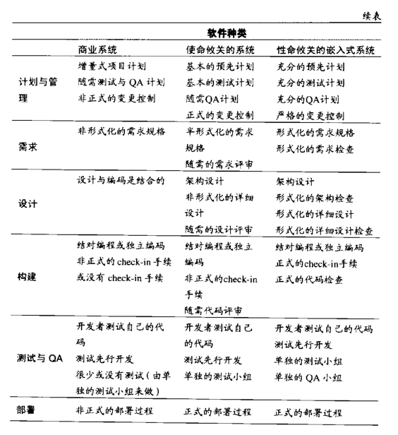
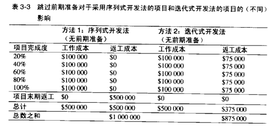
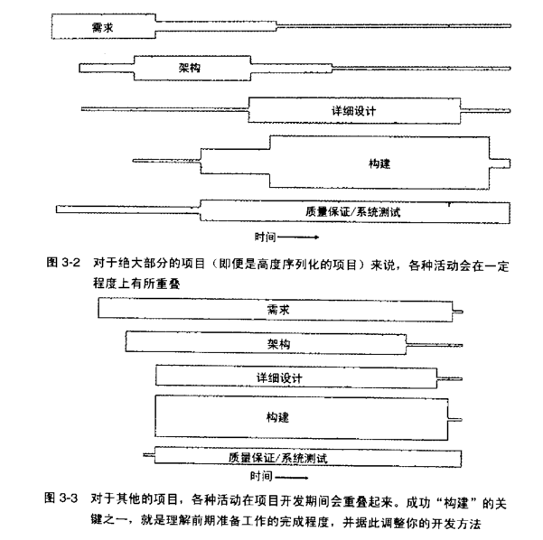

c.3.2 

### Utterly compelling and Foolproof Argument for Doing Prerequisites Befoew Construction

关于开始构建之前要做前期准备的绝对有力且简明的论据

设想你已经到过“问题”定义之山，与名为“需求”之人同行数里，在“架构”之泉面前脱下脏兮兮的外套，然后再“前期准备”之纯净水中沐浴。

那么你就会知道，在实现一个系统之前，你需要理解“这个系统应该做什么”，以及“它该如何做到这些”。

作为技术雇员，你的一部分工作就是培训周围的非技术人员，讲解开发过程。本节将有助你应对那些“尚未觉悟的管理者和老板”。这里有支持“在开始编码、测试、调试之前进行需求分析和架构设计——才能保证关键的方面都做正确”这一观点的大量论据。学习这些论据，然后与老板一同坐下来，进行一次有关开发过程的恳谈。

----

### Appeal to Logic

> 诉诸逻辑

进行有效编程的要领之一是：准备工作很重要。在开始一个大项目之前，应该为这个项目制订计划，这是很有意义的。大的项目需要做更多的计划，而小项目则可以少些。从管理者的角度看，做计划意味着确定项目所需要的时间、人数以及计算机台数。

从技术角度讲，做计划意味着弄清楚你想要建造的是什么，以防止浪费钱去建造错误的东西。

有时候用户在一开始并不完全确定自己想要的是什么，因此值得花费比理想情况下更多的力气，找出他们真正想要的东西。

但这至少比“先做一个错误的东西出来，然后扔掉，并从头来过”的成本要低廉。

在开始动手制作这个系统之前，先好好思考打算如何去做，这也非常重要。你总不希望花费很多的时间和金钱，却毫无必要地走进死胡同（尤其当这样做会增加成本的时候）。

### Appeal to Analogy

> 诉诸类比

建造软件系统跟其他任何花费人力财力的项目是相似的。如果打算建造一座房屋，你需要在开始钉钉子之前准备好手绘草图（表达设计概念）和蓝图（即设计样图，包含所有细节信息）。在浇注混凝土之前必须审核蓝图并获得批准。在软件领域做技术规划也包含同样多的事情。

在把圣诞树树立起来之前，你不会对它做装饰；在打开烟囱之前，你不会生火；你不会在车子的邮箱是空的时候上路去长途旅行；你不会在洗完澡之前就穿戴整齐，也不会在穿袜子之前就穿鞋。

**在做软件时，你也必须按正确的顺序去做事情。**

***程序员是软件食物链的最后一环。架构师吃掉需求，设计师吃掉架构，而程序员则消化设计。***

----

### Example

我们用真实的食物链来比喻软件食物链。在健康的生态环境中，海鸥吃新鲜的鲑鱼，这对海鸥是营养丰富的大餐，因为鲑鱼吃的是新鲜的青鱼，而清鱼吃的是新鲜的水蝽。这是一条健康的食物链。在软件开发中，如果食物链的每一级都有健康的事务，那么最终就会获得由快乐的程序员编写出的健康的代码。

在受到污染的环境中，水蝽在核废料中游泳，青鱼被聚氯联二苯（PCB）污染，而吃青鱼的鲑鱼又在泄露的原油中游荡。海鸥，很不幸，它位于食物链的最后一环，因此它吃下去的不仅仅是不健康的鲑鱼体内的原油，还有青鱼体内的聚氯联二苯和水蝽体内的核废料.。在软件开发中，如果需求被无言了，那么它就会污染架构，而架构又会污染构建。这样会导致程序员脾气暴躁，营养失调；开发出的软件具有放射性污染，而且周身都是缺陷。

如果你正为某个高度迭代的项目做计划，那么在开始构建活动之前，*你需要针对将要构造的每一片段，先弄清楚哪些是最关键的需求和架构要素。*

建造住宅小区的施工人员，在开始建造第一栋房子之前，并不需要知道小区里面每一栋房子的每一个细节。但他会调查施工场所，制定下水道和电线的走向等。如果施工人员准备不充分，那么建造过程很可能会因为“需要在某所已经造好的房子的地下挖一条下水道”而延误。

----

### Appeal to Data

过去 25 年来的研究确凿地证明了，在一开始就把事情做好是最合算的。进行非必要的改动的代价是高昂的。

惠普、IBM、休斯飞机公司、TRW 以及其他组织的研究人员发现，**在构建活动开始之前清除一个错误，那么返工的成本仅仅是“在开发过程的最后阶段（在系统测试期间或者发布之后）做同样事情”的十分之一到百分之一。**

一般而言，这里的原则是：发现错误的时间要尽可能接近引入该错误的时间。**缺陷在软件食物链里面呆的时间越长，它对食物链的后级造成损害就越严重。**

由于需求市首先要完成的事情，需求的缺陷就有可能在系统中潜伏更长的时间，代价也更加昂贵。在软件开发过程的上游引入的缺陷通常比那些再下游引入的缺陷具有更广泛的影响力。这也使得早期的缺陷代价更加高昂。

表 3-1 修复缺陷的平均成本与引入缺陷的时间和检测到该缺陷的时间之间的关系

--------------------------------------------------------------------------
:引入缺陷的时间     :需求		:架构     :构建   :系统测试   :发布之后
--------------------------------------------------------------------------
需求				I            3        5-10       10          10-100
--------------------------------------------------------------------------
架构 				--			 I         10        15          25-100
--------------------------------------------------------------------------
构建				--			--			I		10			 10-25
--------------------------------------------------------------------------

表 3-1 的数据显示，例如，假设在创建架构的期间修复某个架构缺陷需要花 1000 美元，那么在系统测试期间修复这一缺陷，将要花费 15 000 美元。图 3-1 解释了同样的现象。

平均水平的项目仍然把绝大部分的缺陷修正工作放到图 3-1 的右侧进行，这也就意味着“调试连同相应的返工” 在典型的软件开发周期中会占据大约 50% 的时间。许多公司发现，只需在项目中尽早集中纠正缺陷，就能将开发的成本和时间减半（甚至更多）。所以你应该尽早查找并修正错误。

----

### Boss-Readiness Test
“老板就绪”测试

如果你觉得你的老板已经明白了“在开始构建之前进行前期准备”的重要性，那么试试以下的测试，以确保他确实明白了。

下面的句子哪些是自我实现的语言(self-fulfilling prophecies)?

- 我们最好立刻开始编码，因为将会有很多的调试工作需要做。

- 我们并没有为测试安排太多的时间，因为将来不会发现多少缺陷。

- 我们已经非常详细地研究了需求和设计，我想不出编码和调试期间还会遇到什么大问题。

上面这些陈述都是自我实现的语言。要瞄准最后那个。

> 自我实现预言，是指当你对未来的行为或事件预测时，就会对你行为的互动改变很大，以至于产生预期的结果。

3.2.x  Determine the Kind of Software You're Working On
辨明你所从事的软件的类型

Caper Jones 是 Software Productivity Research(软件生产率研究)的首席科学家，他回顾 20 年的软件研究，指出他和同时见过不止 700 种不同的编程语言，以及 40 中收集需求的方法、50 种进行软件设计的方法、30 种针对项目的测试方法。

不同种类的软件项目，需要在“准备工作”和“构建活动”之间做出不同的平衡。每一个项目都是独特的，但是项目可以归入若干种开发风格。

表 3-2 列出了三种最常见的软件项目种类，并且列出了各种项目最适合的典型实践。

----

在真实项目中，你会找到表中所列这三种主调的无数种变奏；无论如何，表中已经列举了它们的共性。

*开发商业系统的项目*往往受益于**高度迭代的开发法**，这种方法的“计划、需求、架构”活动与“构建、系统测试、质量保证”活动交织在一起。

*性命攸关的系统往*往要求采用更加序列式的方法——“需求稳定”是确保“超高等级的可靠性”的必备条件之一。

----

### Iterative Approaches' Effect on Prerequisites
迭代开发法对前期准备的影响

有些作者断言，使用迭代技术的项目基本无须关注前期准备，但这种观点是错的。
迭代方法往往能够减少“前期准备不足”造成的负面影响，但是它不能完成消除此影响。

让我们看一下表 3-3 所示的例子，这两个项目都没有关注前期准备工作。

- 第一个项目按序列化开发法运作，并且仅仅依赖于测试来发现缺陷。

- 第二个项目则是按迭代方式运作，并且随着项目的进展不断找出错误。

第一个方法将绝大部分缺陷修正工作推迟到项目快结束的时候进行，使得成本较高。（如表 3-1 所述）

而迭代式开发法在项目进行过程中一点点地吸收消化返工，这样使得总体成本较低。这个表中的数据和下一个表中的数据仅仅是为了距离说明，但是这两种通常的开发方法的成本的这种相对关系，是收到本章前面部分提到的那些研究支持的。

----

那些简化或取消了前期准备工作的迭代型项目与采用同样做法的序列项目相比，有两点不同。首先，平均的缺陷修正成本低一些，因为发现缺陷的时间往往更接近引入该缺陷的时间。

然而，每一轮迭代仍然要到最后才能检测到缺陷，为了修正这些缺陷，需要对软件的某些部分进行重新设计、重新编码并重新测试——这使得修正缺陷的成本高于实际需要。

其次，使用迭代式开发法，成本将会在整个项目过程当中分次支付，而不会聚集中项目末尾一次性支付。整个项目尘埃落定之后，实际的总成本是相似的，但是看起来却没有那么高，因为开发费用是在整个项目进行过程中分期支付的，而不是在项目最后一次性结账。

如表 3-4 所示，无论你使用的是迭代式开发法环视序列式开发法，只要进行前期准备，就可以减少成本。“迭代式开发法通常是更好的选择”这一观点有很多的理由支持。但是忽略前期准备的迭代式开发法，最终明显会比“密切关注前期准备工作的序列式开发法”付出更高的代价。

正如表 3-4 所暗示的，绝大多数的项目都不会完全使用序列式开发法或者完全使用迭代式开发法。预先详细说明 100% 的需求和设计师不切实际的，不过对绝大多数项目来说，**“尽早把哪些最关键的需求要素和架构要素确定下来”**是很有价值的。

一条很有用的经验规则是，计划好预先对大约 80% 的需求做出详细说明，并给“稍后再进行详细说明的额外需求”分配一定的时间。然后在项目进行过程中，实施系统化的变更控制措施——只接受那些最有价值的新需求。

另一种替代方案是，预先只对**最重要的 20% 的需求**做出详细说明，并且计划以小幅增量开发软件的剩余部分，随着项目的进行，对额外的需求和设计做出详细说明。

----

### Choosing Between Iterative and Sequential Approaches

在序列式开发法和迭代式开发法之间做出选择

前期准备预先要满足哪些条件，会随表 3-2 所列出的不同项目种类、项目的正式程度、技术环境、员工能力以及项目的商业目标变化而变化。你可能因为下列原因选择一个更加序列化的方法。

- 需求相当稳定

- 设计直接了当，而且理解透彻

- 开发团队对于这一应用领域非常熟悉

- 项目的风险很小

- “长期可预测性”很重要

- 后期改变需求、设计和编码的代码很可能较昂贵

----

你可能因为下列原因悬着一个更加迭代（as-you-go，走着瞧）的方法。

- 需求并没有被理解透彻，或者出于其他理由你认为它是不稳定的。
- 设计很复杂，或者有挑战性，或者两者兼具。
- 开发团队对于这一应用领域不熟悉。
- 项目包含许多风险
- “长期预测性”不重要
- 后期改变需求、设计和编码的代价很可能较低

你应该首先确定哪些前期准备活动适合你的项目。

有些项目在前期准备上面花的时间太少了，结果使得在构建活动中遇到大量不必要的反复修改，同时阻碍了项目的稳步前进。

有些项目则预先做了太多的事情，固执地坚持缘由的需求和计划，后来事实证明这些需求和计划是无效的，这同样阻止了构建活动的顺利进展。

> 如何判断每一项特定的前期准备工作是否到位。

