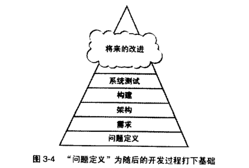

### 3.3 Problem-Definition Prerequisite

### 问题定义的先决条件

> 如果“框框”是约束和条件的边界，那么诀窍在于找到这个“框框”......不要在"框框"之外思考——找到这个“框框”。

在开始构建之前，首先要满足的一项先决条件是，对这个系统要解决的问题做出清楚的陈述。

这有时称为`“产品设想/product vision”`、`“设想陈述/vision statement”`、`"任务陈述/mission statement"` 或者 `"产品定义/product definition"`。

这里将它称为**`“问题定义/problem definition”`**。由于这本书是关于软件构建的，本节不打算告诉你如何去写问题定义，而是告诉你如何辨认是否已经写好了问题定义，以及它能否成为构建活动的良好基础。

**“问题定义”** 只定义了 “问题是什么”，而不涉及任何可能的解决方案。它是一个很简单的陈述，可能只有一到两页，并且听起来应该像一个问题。

像“我们跟不上 Gigatron的订单了” 这样的句子听起来像是个问题，而且确实是一个很好的问题定义。而“我们需要优化数据自动采集系统，使之跟上 Gigatron 的订单”这种句子是糟糕的问题定义。它听起来不像问题，倒像解决方案。

如图 3-4 所示，问题定义在具体的需求分析工作之前，而需求分析是对所定义的问题的深入调查。

**问题定义应该用客户的语言来书写，而且应该从`客户的角度`来描述问题。**

通常不应该用计算机的专业术语叙述。最好的解决方案未必是一个计算机程序。

假定你需要一份展示年度利润的报表。你已经用电脑制作了季度报表。如果你受困于程序员的思维方式，那么你会推断：在已经能生成季度报表的系统中添加生成年度报表的功能应该不难。

然后吩咐某个程序员花许多时间去编写并调试一个计算年度利润的程序。但是如果你没有受限于程序员的思维方式，你会吩咐你的秘书去制作年度报表。

她只需花一分钟时间，用袖珍计算器将四个季度的数据加到一起，就能完成任务。

这条规则也有例外，那就是需要解决的就是与计算机本身相关的问题：编译时间太长，或者开发工具 bug 太多。在这种情况使用计算机术语或程序员术语来陈述问题是恰当的。

**如图 3-5 所示，如果没有一个良好的问题定义，你努力解决的可能是一个错误的问题。**

**“未能定义问题”的处罚是，你浪费了大量时间去解决错误的问题。这是双重处罚，因为你也没有解决正确的问题。**

