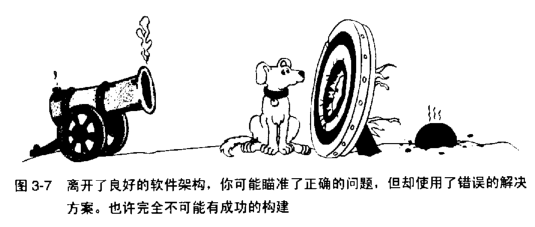

## 3.5 Architecture Prerequisite

## 架构的先决条件

软件架构 (Software architecture) 是软件设计的高层部分，是用于支撑更细节的设计的框架。

架构也称为“系统架构/system architecture”、“高层设计/high-level design” 或 “顶层设计/top-level design”。

通常会用一份独立的文档描述架构，这份文档称为“架构规格书/archirecture specification” 或者“顶层设计”。

有些人对“架构”和“高层设计”加以区分——架构指的是适用于整个系统范围的设计约束，而高层设计指的适用于子系统层次或多个类的层次上的设计约束（但不是整个系统范围的设计）。

由于本书是关于软件构建，因此本节不会告诉你如何开发一个软件的架构；它关注的是如何确定一个业已存在的架构的质量。因为架构比需求离构建活动又近了一步，所以对架构的讨论也会比对需求的讨论更详细一下。

为什么要把架构作为前期准备呢？因为架构的质量决定了系统的“概念完整性”。后者继而决定了系统的最终质量。一个经过慎重考虑的架构为“从顶层到底层维护系统的概念完整性”提供了必备的结构和体系，它为程序员提供了指引——其细节程度与程序员的技能和手边的工作相配。它将工作分为几个部分，使多个开发者或者多个开发团队可以独立工作。

好的架构使得构建活动变得更容易。糟糕的架构则使构建活动几乎寸步难行。

离开了良好的软件架构，你可能瞄准了正确的问题，但却使用了错误的解决方案。也许完全不可能有成功的构建。

在构建期间或者更晚的时候进行架构变更，代价也是高昂的。修复软件架构中的错误所需的时间与修复需求错误所需的时间处于同一数量级——即，多于修复编码错误所需的时间。架构变更如同需求变更一样，看起来是一个很小的改动，影响也许是非常深远的。无论为了修正错误还是改进设计而引发架构变更，越早识别出变更越好。

### Typical Architecture Components

架构的典型组成部分

很多组成部分是优秀的系统架构所共有的。如果你自己构建整个系统，那么在架构工作会与更详细的设计工作有重叠部分。在这种情况下，你至少应该思考架构的每个组成部分。如果你目前从事的系统的架构师别人做的，你应该能够不费力地找出其中重要的组成部分（无须戴上猎鹿帽、牵着猎犬、手拿放大镜）。

在这两种情况中，你都需要考虑以下的架构组成部分。

### Program Organization

程序组织

> 如果你不能向一个六岁小孩解释某件事，那么你自己就没有真正理解它。- Albert Einstein

系统架构首先要以概括的形式对有关系统做一个综述。如果没有这种综述，要想将成千的局部图片（或十多个单独的类）拼成一副完整的图画是相当费脑筋的。如果系统是小小的只有 12 块的智力拼图玩具，你那一岁的小孩也能在眨眼功夫解决它。

不过把 12 个子系统拼到一起要困难一些，而且如果你不能将它们拼起来，那么就无法理解你正在开发的那个类对系统有何贡献。

在架构中，你应该能发现对那些曾经考虑过的最终组织结构的替代方案的记叙，找到之所以选用最终的组织结构，而不用其他替代方案的理由。如果对某个类在系统中的角色没有一个清晰的构思，那么编写这个类就是一件令人灰心丧气的工作。

描述其他组织结构，才能说明架构最后选定的这种系统组织结构的缘由，并且表明各个类都是慎重考虑过的。有一份对设计实践的综述发现，“维护‘设计的缘由’“至少与”维护设计本身“一样重要。

架构应该定义程序的主要构造块（building blocks）。根据程序规模不同，各个构造块可能是单个类，也可能是由许多类组成的一个子系统。每个构造块无论是一个类还是一组协同工作的类和子程序，它们共同实现一种高层功能，诸如与用户交互、显示 Web 页面、解释命令、封装业务规则、访问数据，等等。

每条列出在需求中功能特性（feature）都至少应该有一个构造块覆盖它。如果两个或多个构造块声称实现同一项功能，那么它们就应该相互配合而不会冲突。

**应该明确定义各个构造块的责任。**每个构造块应该负责某一个区域的事情，并且对其他构造块负责的区域知道得越少越好。通过使各个构造块对其他构造块的了解达到最小，你能将设计的信息局限于各个构造块之内。

**应该明确定义每个构造块的通信规则**。对于每个构造块，架构应该描述它能直接使用哪些构造块，能间接使用哪些构造块，不能用哪些构造块。

### Major Classes

主要的类

架构应该详细定义所用的主要的类。它应该指出每个主要的类的责任，以及该类如何与其他类交互。它应该包含对类的集成体系、状态转换、对象持久化等的描述。如果系统足够大，它应该描述如何将这些类组织成一个个子系统。

架构应该记述曾经考虑过的其他类设计方案，并给出选用当前的组织架构的理由。架构无须详细说明系统中的每一个类。**瞄准 80/20 法则：对那些构成系统的 80% 的行为的 20 的类进行详细说明。**

### Data Design
数据设计

架构应该描述所用到的主要文件和数据表的设计。它应该描述曾经考虑过的其他方案，并说明做出选择的理由。如果应用程序要维护一个客户 ID 的列表，而架构师决定使用顺序访问的列表（sequential-access list）来表示该 ID 表，那么文档就应该解释为什么顺序访问的列表比随机访问的列表（random-access list）、堆栈、散列表要好。

在构建期间，这些信息让你能洞察架构师的思想。在维护阶段，这种洞察力是无价之宝。离开它，你就像看一部没有字幕的外语片。

数据通常只应该由一个子系统或一个类直接访问；例外的情况就是透过访问器类（access class）或访问器子程序（access routine）——以受控且抽象的方式——来访问数据。详细的解释请看第 5.3 节中的“隐藏秘密（信息隐藏）”。

架构应该详细定义所用数据库的高层组织结构和内容。架构应该解释为什么单个数据库比多个数据库要好（反之亦然），解释为什么不用平坦的文件而要用数据库，指出与其他访问同一数据的程序的可能交互方式，说明会创建哪些数据视图（view），等等。

### Business Rules

业务规则

如果架构依赖于特定的业务规则，那么它就应该详细描述这些规则，并描述这些规则对系统设计的影响。例如，假定要求系统遵循这样一条业务规则：客户信息过时的时间不能超过 30 秒。在此情况下，架构就应该描述这条规则对架构采用的“保持客户信息及时更新且同步”的方法的影响。

### User Interface Design

用户界面设计

用户界面常常在需求阶段进行详细说明。如果没有，就应该在软件架构中进行详细说明。架构应该详细定义 Web 页面格式、GUI、命令行接口（command line interface）等的主要元素。精心设计的用户界面架构决定了 最终做出来的是“人见人爱的程序”还是“没人爱用的程序”。

架构应该模块化，以便在替换为新用户界面时不影响业务规则和程序的输出部分。例如，架构应该使我们很容易地做到：砍掉交互式界面的类，插入一组命令行的类。这种替换能力常常很有用，尤其因为命令行界面便于单元级别和子系统级别的软件测试。

### Security

安全性

### Performance

性能

### Scalability

可伸缩性

可伸缩性是指系统增长以满足未来需求的能力。架构应该描述系统如何应对用户数量、服务器数量、网络节点数量、数据库记录数、数据库记录的长度、交易量等的增长。如果预计系统不会增长，而且可伸缩性不是问题，那么架构应该明确地列出这一假设。

### Interoperability

互用性

### Internationalization/Localization
国际化/本地化

“国际化”是一项“准备让程序支持多个 locales(地域/文化)”的技术活动。国际化常常称为“I18n”，因为国际化的英文单词“Internationalization”首尾两个字符“I” 和 "N" 之间一共有 18 个字母。

“本地化/Localization”（称为 “L10n”）活动是翻译一个程序，以支持当地特定的语言的工作。

### Input/Output
输入/输出

### Error Processing
错误处理

有人估计程序中高达 90% 的代码是用来处理异常情况、进行错误处理、或做簿记(housekeeping)工作，意味着只有 10% 的代码是用来处理常规的情况。

错误处理常被视为是“代码约定层次/coding-convention-level”的事情。

- 错误处理是进行纠正还是仅仅进行检测？如果是纠正，程序可以尝试从错误中回复过来。如果仅仅是检测，那么程序可以像“没有发生任何事”一样继续运行，也可以退出。无论哪一种情况，都应该通知用户说检测到一个错误。

- 错误检测是主动地还是被动的？系统可以主动地预测错误——例如，通过检测用户输入的有效性——也可以在不能避免错误的时候，被动地响应错误——例如，当用户输入的组合产生了一个数值溢出错误时。前者可以扫清障碍，后者可以清除混乱。同样，无论采用哪种方案，都与用户界面有影响。

- 程序如何传播错误？程序一旦检测到错误，它可以立刻丢弃引发该错误的数据：也可以把这个错误当成一个错误，并进入错误处理状态；或者可以等到所有处理完成，再通知用户说在某个地方发现了错误。

- 错误消息的处理有什么约定？如果架构没有详细定义一个一直的处理策略，那用户界面看起来就像“令人困惑的乱七八糟的抽象拼贴画”，由程序的不通过部分的各种界面拼接而成。要避免这种外观体验，架构应该建立一套有关错误消息的约定。

- 如何处理异常（exception）? 架构应该规定代码何时能够抛出异常，在什么地方捕获异常，如何记录（log）这些异常，以及如何在文档中描述异常，等等。

- 在程序中，在什么层次上处理错误？

- 每个类在验证其输入数据的有效性方面需要负何种责任？

- 你是希望用运行环境中内建的错误处理机制，还是建立自己的一套机制？

### Fault Tolerance

容错性

### Architectural Feasibility

架构的可行性

(proof-of-concept prototype, 通过验证概念的原型)

### Overengineering
过度工程

健壮性(robustness)

### Buy-vs.-Build Decisions
关于“买” 还是“造”的决策

### Reuse Decisions
关于复用的决策

### Change Strategy
变更策略

### General Architectural Quality
架构的总体质量

《人月神话》的中心论题，说的就是大型系统的本质问题是维持其“概念完整性”。

好的架构设计应该与待解决的问题和谐一致。在查看架构的时候，你应该很愉快，因为它给出的解决方案看上去既自然又容易。而不应该看起来像是用胶带把架构和待解决的问题硬捆到一起。

你也许知道在架构的开发过程中的多种变更方式。每一项变更都应该干净地融入整体概念。架构不应该看起来像是美国国会的政府年度预算案一样，由各议员为自家选民所争取的地方建设经费拼凑而成。

架构的目标应该清楚地表述。以系统的可更改性（modifiability）为首要目标的设计，以性能方面决不妥协为首要目标的设计肯定是不同的——即便两个系统的功能一样。

**架构应该描述所有主要决策的动机。**谨防“我们向来这么做”这种自认为有理的说法。

有一个这样的故事，Beth 想按照她丈夫家祖传的广受好评的炖肉菜谱来做一锅炖肉。她丈夫说，他母亲是这样教他的：先撒上盐和胡椒，然后去头去尾，最后放到平底锅里盖上盖子炖。Beth 就问了：“为什么要去头去尾呢？”

Abul 回答说：“我不知道，我向来这么做。这得问一下我母亲。”他打电话给母亲，母亲说：“我不知道，我向来这么做。这得问一下你祖母。”

他母亲打电话问祖母，祖母回答说：“我不知道你为什么要去头去尾。我这么做事因为我的锅太小了转不下。”

优秀的软件架构很大程度上是与机器和编程语言无关的。不可否认的是，你不能忽视构建的环境。无论如何，要尽可能地独立于环境，这样你就能抵抗对系统进行过度架构（overarchitect）的诱惑，也避免提前去做那些放到构建设计期间能做得更好的工作。如果程序员的用途就是去试验某种特定的机器或者语言，那么这一条指导原则就不适用了。

架构应该踏在对系统“欠描述/underspecifying”和“过度描述/overspecifying”之间的那条分界线上。没有哪一部分架构应该得到比实际需要更多的关注，也不应该过度设计（overdesigned）。设计者不应该将注意力放在某个部件上，而损害其他部件。架构应该处理所有的需求，同时又不去镀金（不包含不需要的元素）。

架构应该明确地指出有风险的区域。它应该解释为什么这些区域是有风险的，并说明已经采取了哪些步骤以使风险最小化。

架构应该包含多个视角（视图）。房屋的设计图包括正视图、平面图、结构图、电路布线图及其他视图。软件架构的描述也能从“提供系统的不同视图”中收益。包括暴露隐藏的错误和不一致的情况，以及帮助程序员完整地理解系统的设计。

最后，你不应该担忧架构的任何部分。架构不应该包含任何仅仅为了取悦老板的东西。它不应该包含任何对你而言很难理解的东西。你就是那个实现架构的人：如果你自己都弄不懂，那怎么实现它？

### Checklist: Architecture

核对表：架构

以下是一份问题列表，优秀的架构应该关注这些问题。这张核对表的意图并非用做一份有关如何做架构的完全指南，而是作为一种实用的评估手段，用来评估软件食物链到了程序员这一头还有多少营养成分。这张核对表可用做你自己的核对表的出发点。就像“需求”的核对表一样，如果你从事的是非正式项目，那么你会发现其中某些条款甚至都不用去想。如果你从事的是更大型的项目，那么大多数条款都会是很有用的。

针对各架构主题

- 程序的整体组织结构是否清晰？是否包含一个良好的架构全局观（及其理由）？

- 是否明确定义了主要的构造块（包括每个构造块的职责范围及其他构造块的接口）？

- 是否明显涵盖了“需求”中列出的所有功能（每个功能对应的构造块不太多也不太少）？

- 是否描述并论证了那些最关键的类？

- 是否秒了并论证了数据设计？

- 是否详细定义了数据库的组织结构和内容？

- 是否指出了所用关键的业务规则，并描述其对系统的影响？

- 是否描述了用户界面设计的策略？

- 是否将用户界面模块化，使界面的变更不会影响程序其余部分？

- 是否描述并论证了处理 I/O 的策略？

- 是否估算了稀缺资源（如线程、数据库连接、句柄、网络带宽等）的使用量，是否描述并论证了资源管理的策略？

- 是否描述了架构的安全需求？

- 架构是否为每个类、每个子系统、或每个功能域（functionality area）提出空间与实践预算？

- 架构是否描述了如何达到可伸缩性？

- 架构是否关注互操作性？

- 是否描述了国家化/本地化的策略？

- 是否提供了一套内聚的错误处理策略?

- 是否规定了容错的办法（如果需要）？

- 是否证实了系统各个部分的技术可行性？

- 是否详细描述了过度工程（overengineering）的方法？

- 是否包含了必要的“买 vs. 造”的策略？

- 架构是否描述了如何加工被复用的代码，使之 符合其他架构目标？

- 是否将架构设计得能够适应很可能出现的变更？

### 架构的总体质量

- 架构是否解决了全部需求？

- 有没有哪部分是“过度架构/overarchitected” 或“欠架构/underachitectured”？是否明确宣布了在这方面的预期指标？

- 整个架构是否在概念上协调一致？

- 顶层设计是否独立于用作实现它的机器和语言？

- 是否说明了所有主要的决策的动机？

- 你，作为一名实现该系统的程序员，是否对这个架构感觉良好？

